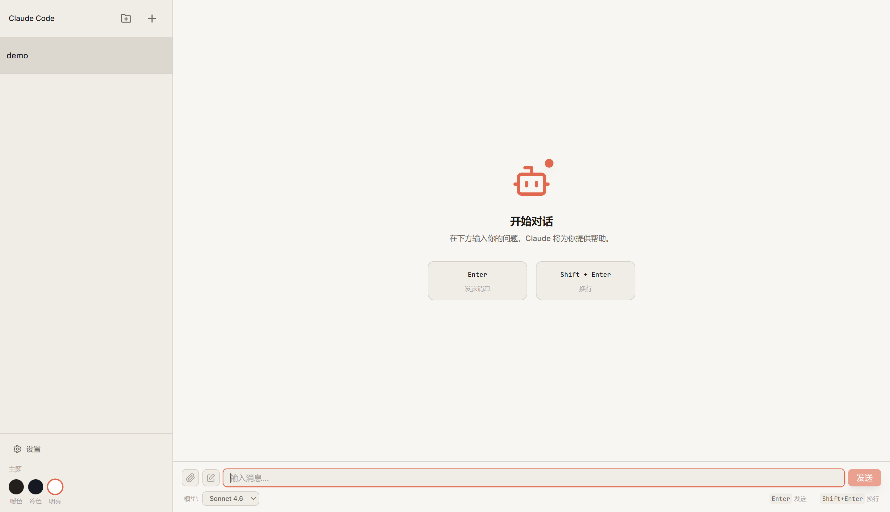

<p align="center">
  <h1 align="center">Claude Code Desktop</h1>
  <p align="center">一个免费、开源的 <a href="https://docs.anthropic.com/en/docs/claude-code">Claude Code CLI</a> 桌面 GUI 客户端</p>
</p>

## 截图

> 

## 功能

- **图形化聊天界面** — 像聊天应用一样与 Claude Code 交互，告别纯终端操作
- **多会话管理** — 同时管理多个对话会话，按需切换
- **会话分组** — 将相关会话组织到不同分组中，保持工作区整洁
- **流式输出** — 实时显示 Claude 的响应，打字效果流畅自然
- **Markdown 渲染** — 完美渲染代码块、表格、列表等富文本格式
- **文件引用** — 在对话中引用本地文件，Claude 可直接读取
- **文件上传** — 将本地文件添加到对话上下文中
- **MCP 支持** — 管理 MCP 服务器和工具白名单，扩展 Claude 能力
- **主题切换** — 支持亮色/暗色主题
- **模型切换** — 自由选择 Claude 模型（Sonnet、Opus 等）
- **跨平台** — 支持 Windows、macOS、Linux

## 技术栈

| 类别 | 技术 |
|---|---|
| 桌面框架 | Electron 34 |
| 前端 | React 19 + TypeScript 5.7 |
| 构建工具 | electron-vite |
| 样式 | Tailwind CSS 4 + Radix UI |
| 终端管理 | node-pty |
| 状态管理 | React Context + useReducer |
| 持久化 | 本地 JSON 文件 |

## 快速开始

### 前置条件

- [Node.js](https://nodejs.org/) >= 18
- [Claude Code CLI](https://docs.anthropic.com/en/docs/claude-code) 已安装并认证

```bash
# 确保 claude CLI 可用
claude --version
```

### 开发模式

```bash
# 克隆仓库
git clone https://github.com/YOUR_USERNAME/claude-code-desktop.git
cd claude-code-desktop

# 安装依赖
npm install

# 启动开发模式（热更新）
npm run dev
```

### 打包

```bash
# 打包为可运行目录（调试用）
npm run pack

# 打包当前平台安装包
npm run dist

# 按平台打包
npm run dist:win     # Windows (NSIS 安装包)
npm run dist:mac     # macOS (DMG)
npm run dist:linux   # Linux (AppImage)
```

打包产物在 `release/` 目录下。

### 一键启动（Windows）

项目根目录提供了 `start.bat`，双击即可：
- 首次运行时自动编译 + 打包
- 后续直接启动应用

## 项目结构

```
src/
├── shared/types.ts           # 共享类型定义 (IPC 通道、Session、Message等)
├── main/                     # Electron 主进程
│   ├── index.ts              # 入口: 窗口创建 + IPC 注册
│   ├── claude-manager.ts     # node-pty 进程管理
│   ├── session-store.ts      # 会话 CRUD + JSON 持久化
│   ├── config-manager.ts     # 配置管理 (模型列表、用户设置)
│   ├── group-store.ts        # 会话分组管理
│   ├── mcp-manager.ts        # MCP 服务器配置管理
│   ├── ipc-handlers.ts       # 所有 IPC 通道的 handler 注册
│   └── path-utils.ts         # 路径工具
├── preload/index.ts          # contextBridge 暴露安全 API
└── renderer/                 # React 渲染进程
    ├── index.html
    └── src/
        ├── main.tsx          # ReactDOM 入口
        ├── App.tsx           # 根布局 (Sidebar + MainContent)
        ├── context/          # 全局状态 (AppContext)
        ├── hooks/            # 自定义 hooks
        └── components/       # UI 组件
```

## 架构

```
┌─────────────────────────────┐
│        Electron 主进程        │
│  ┌──────────┐ ┌───────────┐ │
│  │  Claude   │ │  Session  │ │
│  │  Manager  │ │  Store    │ │
│  └─────┬─────┘ └───────────┘ │
│        │ node-pty             │
│  ┌─────┴─────────────────┐   │
│  │   IPC Handlers         │   │
│  └───────────┬───────────┘   │
└──────────────┼───────────────┘
               │ contextBridge
┌──────────────┼───────────────┐
│   Preload    │                │
│   (安全 API 暴露)              │
├──────────────┼───────────────┤
│   渲染进程    │                │
│  ┌───────────┴───────────┐   │
│  │   React App            │   │
│  │   (AppContext + Hooks) │   │
│  └────────────────────────┘   │
└───────────────────────────────┘
```

Claude Code Desktop 通过 `node-pty` 管理本地 `claude` CLI 进程，每条消息启动一个 `claude -p "..." --model xxx` 进程，读取完整输出后退出。会话连续性通过 CLI 自身的 `--continue` 实现。

## Contributing

欢迎提交 Issue 和 Pull Request！

## License

[MIT](LICENSE)

## 相关链接

- [Claude Code 官方文档](https://docs.anthropic.com/en/docs/claude-code)
- [Electron 文档](https://www.electronjs.org/)
- [electron-vite](https://electron-vite.org/)
